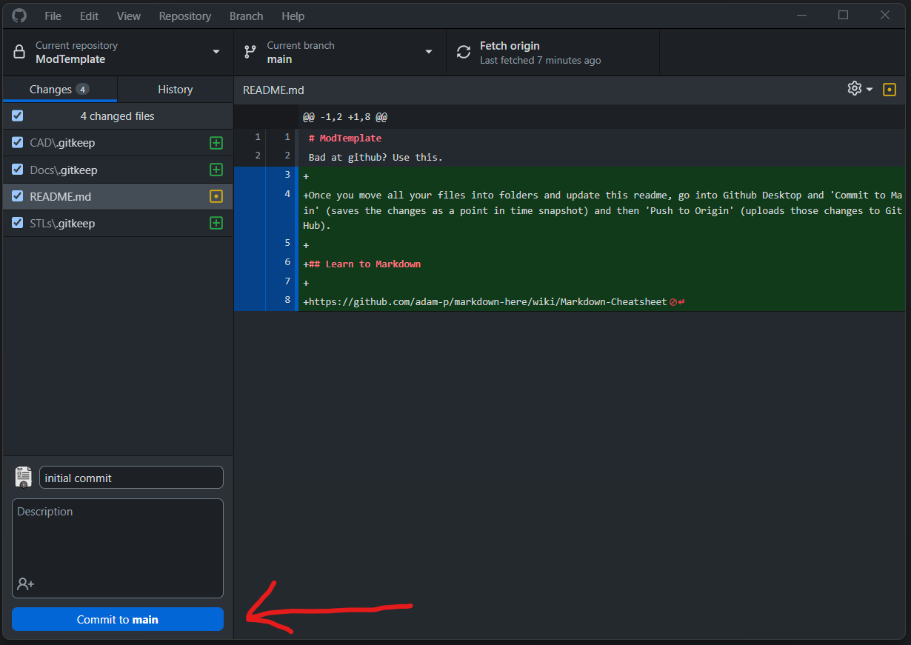
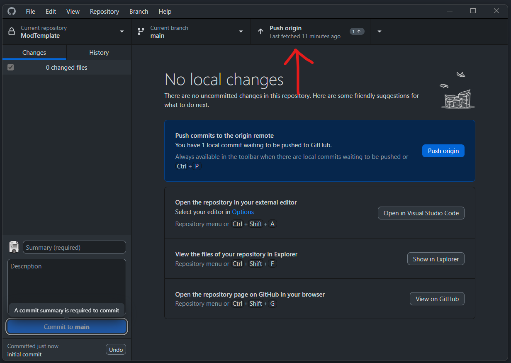

# ModTemplate
Bad at github? Use this.

1. Install Github Desktop
2. Fork this (or another) repo 
3. Name your fork whatever you want
4. Clone your new repo to your computer 

Once you move all your files into folders and update this readme, go into Github Desktop and 

1. 'Commit to Main' (saves the changes as a point in time snapshot) 
2.  Then 'Push to Origin' (uploads those changes to GitHub). 

## Learn to Markdown

https://github.com/adam-p/markdown-here/wiki/Markdown-Cheatsheet